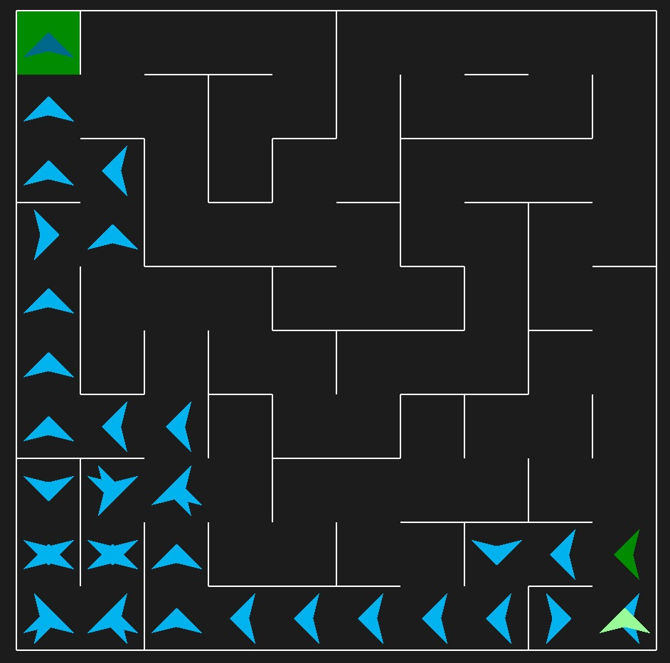
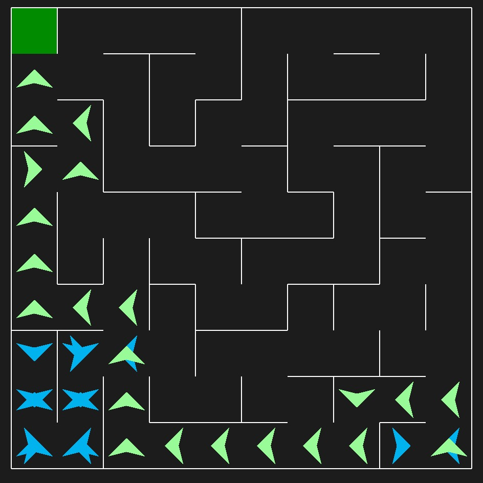

# Algoritmo Wall Follower - Labirinto




> O algoritmo implementado utiliza a estratégia do seguidor de paredes para resolver labirintos. Essa abordagem consiste em seguir uma das paredes do labirinto enquanto tenta encontrar a saída, garantindo que o agente eventualmente percorra todo o espaço acessível do labirinto. A lógica foi desenvolvida para trabalhar com a biblioteca pyamaze, que permite a geração e visualização de labirintos.

### 📌Funcionamento do Algoritmo

1. **Orientação Inicial:**  
   O agente começa em uma posição inicial no labirinto, com uma direção inicial predefinida ("Norte").
   
2. **Rotação e Movimentos:**  
   - O agente verifica a presença de paredes à sua esquerda e à frente.  
   - Se houver espaço à esquerda, ele gira no sentido anti-horário e se move para frente.  
   - Se não houver espaço à esquerda, verifica a frente; caso esteja livre, ele avança. Caso contrário, gira no sentido horário.  

3. **Simplificação de Caminho:**  
   Após a navegação, o algoritmo remove movimentos redundantes (como ir para o Leste e depois imediatamente para o Oeste) para otimizar o percurso.

4. **Visualização e Score:**  
   O caminho percorrido pelos agentes é exibido graficamente no labirinto gerado pela biblioteca, e o número de movimentos realizados por dois agentes (um com o caminho completo e outro com o caminho simplificado) é calculado e exibido.

---

### ❗Importância do Algoritmo

1. **Resolução de Labirintos:**  
   O algoritmo é uma solução eficiente para navegar labirintos onde a topologia completa não é conhecida previamente. Sua simplicidade o torna uma boa escolha para situações em que o ambiente é explorado de forma local.

2. **Aplicações Reais:**  
   - **Robótica:** Em ambientes de navegação desconhecidos, como robôs autônomos explorando áreas fechadas.  
   - **IA em Jogos:** Implementação de agentes para resolver puzzles e desafios em jogos de labirinto.  
   - **Pesquisa Operacional:** Análise de rotas e caminhos em sistemas complexos.

3. **Visualização Educativa:**  
   Utilizando `pyamaze`, o algoritmo permite que estudantes visualizem os conceitos de navegação em labirintos e os apliquem em projetos que envolvem orientação espacial.

4. **Otimização de Rotas:**  
   A simplificação do caminho mostra a importância de minimizar movimentos redundantes, o que tem aplicações diretas em logística e planejamento de trajetórias.

---

### ⭐Destaques do Código

- **Dois Agentes:** Um segue o caminho completo, e o outro segue o caminho otimizado, permitindo comparar eficiência.
- **Visualização Interativa:** A biblioteca `pyamaze` oferece uma interface gráfica intuitiva para explorar o comportamento do algoritmo.
- **Flexibilidade:** O algoritmo pode ser adaptado para diferentes tamanhos e configurações de labirintos, além de ser ajustado para diferentes estratégias de navegação.


## 💻 Pré-requisitos

Antes de começar, verifique se você atendeu aos seguintes requisitos:

- Você instalou a versão mais recente do Python (preferencialmente 3.x)
- Você tem uma máquina com Windows, Linux ou macOS.
- Você possui as biblioteca `pyamaze` instalada. Você pode instalá-las usando o seguinte comando:

```
pip install pyamaze
```

## 🚀 Instalando Algoritmo A*

Para instalar o projeto, siga estas etapas:

### Linux e macOS:

Clone o repositório:

```
git clone https://github.com/giclocate/robot-maze-experiment.git
cd robot-maze-experiment
```

### Windows:

Clone o repositório:

```
git clone https://github.com/giclocate/robot-maze-experiment.git
cd mazen.py
```

Instale as dependências necessárias:

```
pip install pyamaze
```

2. O programa irá gerar um labirinto aleatório e exibir a solução encontrada pelo algoritmo A*.

## 🤝 Autora

<table>
  <tr>
    <td align="center">
      <a href="https://github.com/giclocate" title="Usuário">
        <br>
        <sub>
          <b>Giovanna Clócate</b>
        </sub>
      </a>
    </td>
  </tr>
</table>

## 📝 Licença

Esse projeto está sob licença MIT. Veja o arquivo [LICENÇA](LICENSE.md) para mais detalhes.
